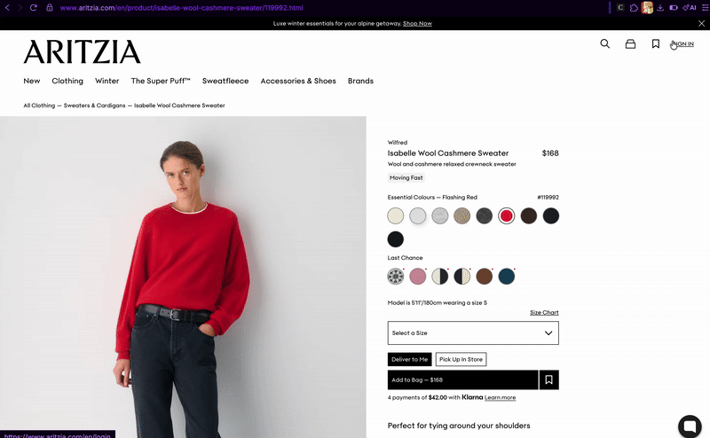
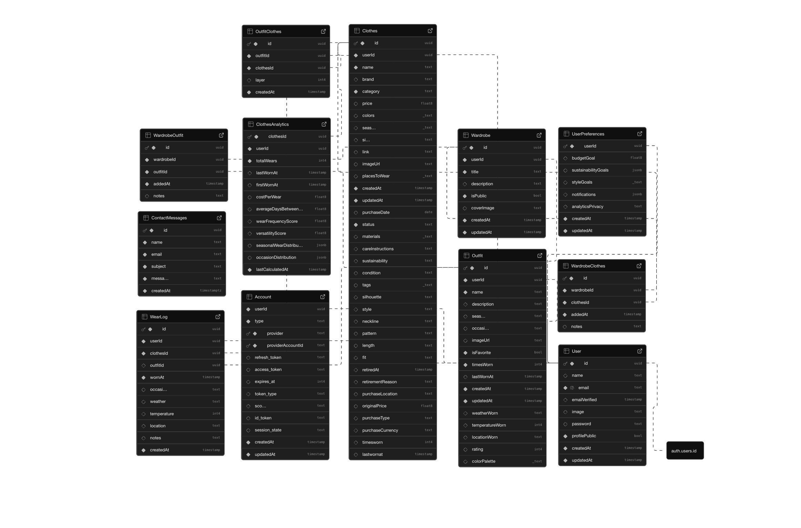

# Capsule — Your Digital Closet

A full-stack wardrobe management application that helps you catalog, organize, and create outfit combinations from your clothing collection.

## Extension Showcase

## Features

- **Secure Authentication**: Sign in with Google or GitHub using NextAuth.js or with email
- **Wardrobe Cataloging**: Add, edit, and delete clothing items with image uploads and detailed metadata (materials, condition, care instructions)
- **Smart Organization**: Filter items by category, color, season, and custom tags
- **Outfit Creation**: Combine clothing items to create and save outfit combinations with one-per-category selection logic
- **Visual Collage Builder**: Create outfit collages with drag-and-drop positioning and resizing
- **Chrome Extension**: Import items directly from online shopping sites
- **Advanced Search**: Quickly find items across your entire wardrobe
- **Analytics Dashboard**: Track wear frequency, wardrobe stats, and outfit trends
- **Responsive Design**: Seamless experience across desktop, tablet, and mobile devices
- **Real-time Updates**: Instant synchronization of your wardrobe data

## Tech Stack

- **Frontend**: Next.js (App Router), React , TypeScript
- **UI Library**: NextUI (HeroUI), Tailwind CSS
- **Backend**: Supabase (PostgreSQL)
- **Authentication**: NextAuth.js with OAuth (Google, GitHub)
- **Image Processing**: html2canvas for collage generation
- **File Storage**: Supabase Storage
- **Chrome Extension**: Manifest V3
- **Deployment**: Vercel
- **Performance**: 95+ Lighthouse score

## Live Demo

Visit the live application at [rcapsule.com](https://rcapsule.com) to see Capsule in action.

## Database Schema

The application uses a normalized PostgreSQL schema with the following main tables:

All tables implement Row Level Security (RLS) to ensure users can only access their own data.

## Deployment

The application is deployed on Vercel with automatic CI/CD:

1. Push to the main branch
2. Vercel automatically builds and deploys
3. Environment variables are configured in Vercel dashboard

## Performance

- Server-side rendering with Next.js App Router
- Optimized image loading and compression
- Lighthouse score: 95+
- Fast page loads and smooth interactions

## Error Monitoring & Performance

- Sentry Integration: Comprehensive error tracking with user context
- Performance Monitoring: Database query optimization and API response tracking
- Breadcrumbs: User action tracking for better debugging
- Production-Ready: Proper error boundaries and graceful degradation

## Contact

Rima Nafougui - [@Mercuryy200](https://github.com/Mercuryy200)

Project Link: [https://github.com/Mercuryy200/ClosetOrganizer](https://github.com/Mercuryy200/ClosetOrganizer)

## Acknowledgments

- [Next.js Documentation](https://nextjs.org/docs)
- [Supabase Documentation](https://supabase.io/docs)
- [NextAuth.js Documentation](https://next-auth.js.org/)
- [Tailwind CSS](https://tailwindcss.com/)
